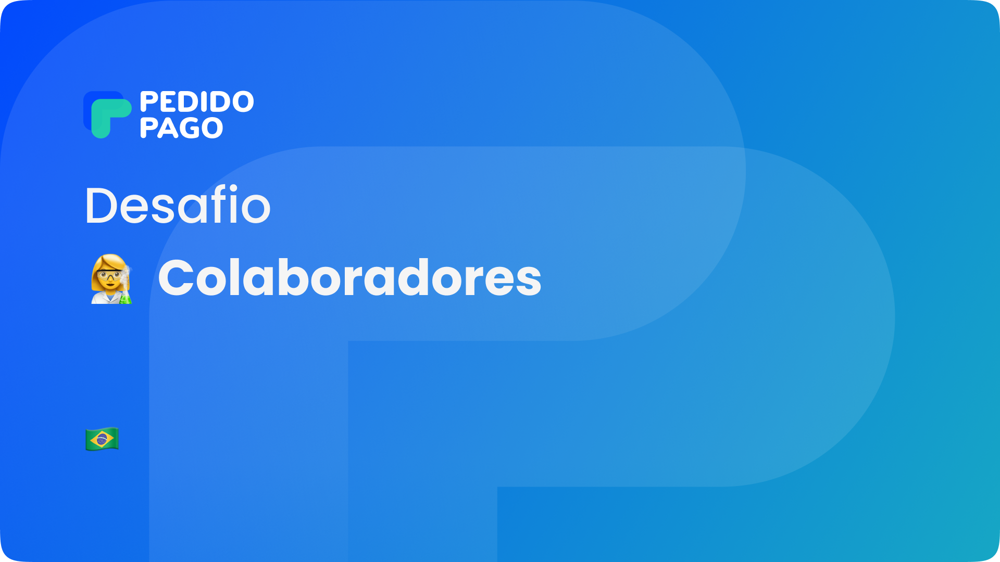

 <h1 align="center">
    
     
 </h1>
 

  <a href="#sobre-o-projeto">Sobre o Projeto</a> |
  <a href="#tecnologias">Tecnologias</a> |

 

  <a href="#funções-do-sistema">Funções do Sistema</a>   |
  <a href="#link-produção">Link Produção</a>

## Sobre o Projeto
Projeto desenvolvido para o processo seletivo para vaga de front-end do Pedido Pago.

O projeto consiste em um ambiente para realizar o gerenciamento dos funcionários de uma empresa

## Tecnologias

## Funções do Sistema
✔️ Responsividade

✔️ Listar Colaboradores

✔️ Pesquisar Colaboradores

✔️ Editar informações dos Colaboradores

✔️ Excluir cadastro dos Colaboradores

✔️ Duplicar cadastro do Colaborador

✔️ Busca paginada

✔️ Definição de permissões e autorizações

## Link Produção

